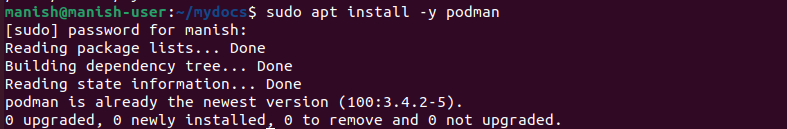
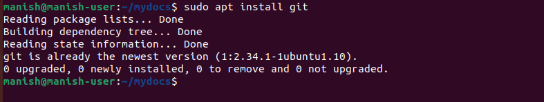
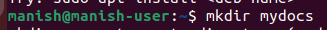
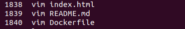
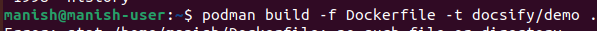
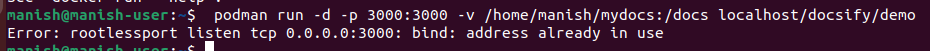
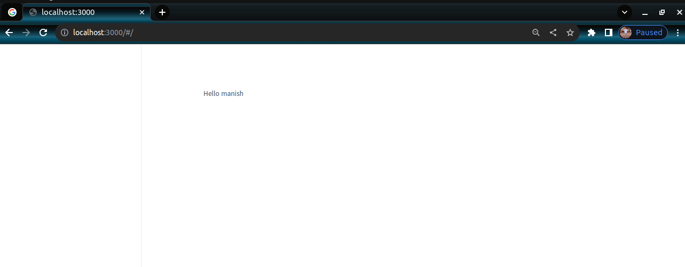
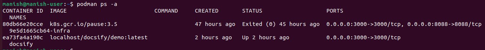
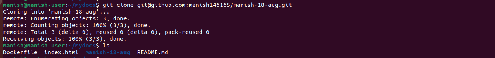
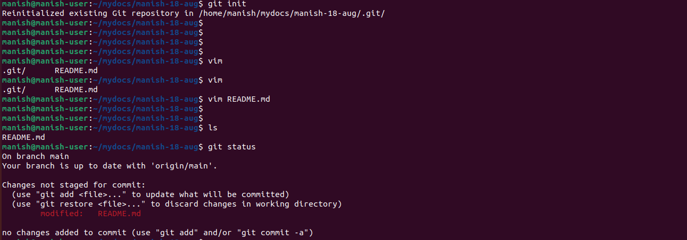

# 
 Setting up Docsify with Podman for GitHub Inteigration

## Docsify
Docsify is a documentation generator that focuses on simplicity and ease of use. It is typically used to create documentation websites for projects, APIs, libraries, or any other kind of technical documentation. Docsify operates entirely on the client-side, meaning that it doesn't require a complex build process or a server to render the documentation.

## GIT
Git is a distributed version control system (VCS) that is widely used for tracking changes in source code during software development. It was created by Linus Torvalds in 2005. Git allows multiple developers to collaborate on a project, keeping track of changes, managing different versions of the codebase, and enabling efficient teamwork.

## Prerequisites

1. Installed Podman and Git on your system.
   
   **Podman Installation**

**sudo apt install -y podman**

    
sudo: This is a special command that allows you to execute other commands with administrative privileges. It's like saying "Hey, I want to do something important, so give me the power to do it."

apt: This is a package manager tool that helps you install, update, and manage software on your Linux system. It's like a digital store where you can get all kinds of programs.

install: This tells the package manager that you want to install a new program or software.

-y: This is an option that stands for "yes." It tells the package manager to automatically answer "yes" to any questions it might ask during the installation process. This way, you don't have to keep confirming things.

podman: This is the name of the software you want to install. In this case, it's a tool that helps you manage and run containers, which are like isolated environments for running applications.

So, when you put it all together:

"sudo apt install -y podman" means "Hey, give me the power to install a program using the package manager. The program I want is called 'podman,' and go ahead and install it without asking me too many questions."

**Git Installation**

**sudo apt install git**

git: This is the name of the program you want to put on your computer. It's a tool that helps you keep track of changes in your code and work together with others on programming projects.

So when you put it all together:

"sudo apt install git" means "Hey, I need your permission to use the assistant to get and install a program called 'git' on my computer."

This command helps you easily install the 'git' program, which is super useful for programmers to manage their code.

# Docsify setup

### create an directory

mkdir: This is like telling your computer to create a new empty folder or directory. Think of it as asking your computer to make a new storage space for you.

mydocs: This is the name you're giving to the new folder you want to create. You can choose any name you like. In this case, you're calling the new folder "mydocs."

So when you put it all together:

"mkdir mydocs" means "Computer, please create a new folder for me and let's call it 'mydocs.'"

This command helps you make a new folder where you can put your documents or files.

### Create three file

**vim Dockerfile  
vim README.md  
vim index.html**

### Making Container

**podman build -f Dockerfile -t docsify/demo .**
podman: This is like a tool that helps you manage and run containers. Containers are kind of like virtual environments for programs.

build: This tells the tool that you want to make a new container. You're building something new.

-f Dockerfile: This is like giving the tool a set of instructions for how to build the container. The "Dockerfile" is a recipe that tells the tool what to include in the container.

-t docsify/demo: This is like giving the new container a name tag. You're labeling it with a name, "docsify/demo."

This command helps you make a new container using specific instructions and gives it a name you can use to find it later.

### Run a container

**podman run -d -p 3000:3000 -v /home/manish/mydocs:/docs localhost/docsify/demo**

run: This tells the tool you want to start a new container and run something inside it.

-d: This means you want the container to run in the background, kind of like a program that's running without showing up on your screen.

-p 3300:3300: This is like opening a window in your computer to let information flow. You're saying, "Connect my computer's port 3300 to the container's port 3300."

-v /home/manish/mydocs:/docs: This is like connecting a special folder on your computer (mydocs) to a folder inside the container (docs). It's like sharing a space for files.

localhost/docsify/demo: This is like telling the tool which container you want to run. You're using the container named "docsify/demo."

### Docsify run on localhost

# Docsify integration with github

**podman ps**

podman: Think of this as a tool you can talk to when you're working with containers. Containers are like special spaces where you can run programs.

ps: This is like asking the tool to show you a list of the containers that are currently doing things on your computer.

This command helps you see what containers are currently active on your computer.

##  Cloning a GitHub Repository

**git clone git@github.com:manish146165/manish-18-aug.git**

git: This is like a special tool that helps you manage and keep track of changes in your code. It's like a smart friend that helps you work on your projects.

clone: This is like asking your smart friend to make a copy of a project that's already on the internet.

git@github.com:manish146165/manish-18-aug.git: This is like telling your smart friend exactly where to find the project. It's like giving them a map with the project's location on GitHub.

This command helps you get a copy of a project from GitHub so you can work on it or check it out on your own computer.

## Start Tracking Changes on Your Project

