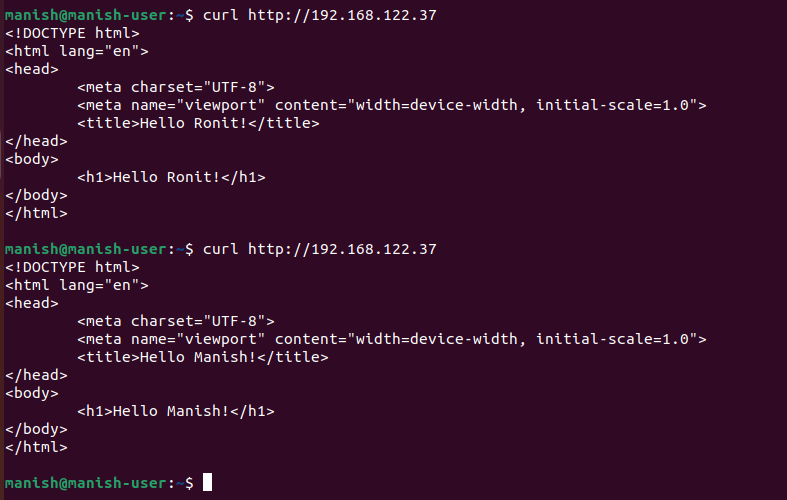

<u>

# Transform iptables into a TCP load balancer

</u>

## Task requirement:

To create two new caddy LB or two nginx and after creating, it needs to forward the 50% of Load to another LB.

 <b>iptables: </b>  is a user-space utility program that allows a system administrator to configure the IP packet filter rules of the Linux kernel firewall.

## Environment details:

manish@manish-user:~$ cat /etc/os-release / 
PRETTY_NAME="Ubuntu 22.04.3 LTS" 
NAME="Ubuntu" 
VERSION_ID="22.04" 
VERSION="22.04.3 LTS (Jammy Jellyfish)" 
VERSION_CODENAME=jammy 
ID=ubuntu 
ID_LIKE=debian 
HOME_URL="https://www.ubuntu.com/" 
SUPPORT_URL="https://help.ubuntu.com/" 
BUG_REPORT_URL="https://bugs.launchpad.net/ubuntu/" 
PRIVACY_POLICY_URL="https://www.ubuntu.com/legal terms-and-policies/privacy-policy" 
UBUNTU_CODENAME=jammy

## List of tools and technologies:
* KVM
* Nginx

## I have configre two vm and install nginx both vm:

vim1 >>>> 192.168.122.37 
sudo apt install nginx

vim2 >>>> 192.168.122.85 
sudo apt install nginx

#### Vm1 >>>>Change the index.html

vm1@vm1-Standard-PC-Q35-ICH9-2009:~$ cd /var/www/html/

vm1@vm1-Standard-PC-Q35-ICH9-2009:/var/www/html$ ls
index.html

##### After running this command:-  sudo vim index.html
* Enter html file

vm1@vm1-Standard-PC-Q35-ICH9-2009:/var/www/html$ sudo vim index.html

#### Vm2 >>>> Change the index.html

vim2@vim2-Standard-PC-Q35-ICH9-2009:~$ cd /var/www/html/

vim2@vim2-Standard-PC-Q35-ICH9-2009:/var/www/html$ ls
index.nginx-debian.html

#### I am able to curl Page from each other.

vm1@vm1-Standard-PC-Q35-ICH9-2009:/var/www/html$ curl http://192.168.122.37

manish@manish-user:~$ curl http://192.168.122.85

manish@manish-user:~$ curl http://192.168.122.37

#### now work in  Vm1 192.168.122.37

a) Enable IP Forwarding:

Activate IP forwarding to facilitate traffic routing between interfaces: 

 vm1 and vm2
Same process

vm1@vm1-Standard-PC-Q35-ICH9-2009:~$ sudo vim /etc/sysctl.conf
[sudo] password for vm1: 

#### uncomment in the file below line.

net.ipv4.conf.default.rp_filter = 1
net.ipv4.conf.all.rp_filter = 1
net.ipv4.tcp_syncookies = 1
net.ipv4.ip_forward = 1
net.ipv4.conf.all.accept_redirects = 0
net.ipv4.conf.all.send_redirects = 0
net.ipv4.conf.all.accept_source_route = 0
net.ipv4.conf.all.log_martians = 1

vm1@vm1-Standard-PC-Q35-ICH9-2009:~$ sudo sysctl -p

####  Modify source IP for forwarding: this command run vm1 source

vm1@vm1-Standard-PC-Q35-ICH9-2009:~$  sudo iptables -A POSTROUTING  -t nat -p tcp  -d 192.168.122.85 --dport 80 -j SNAT --to-source 192.168.122.37

#### Set default connection drop vm1 

This implies that by default, any incoming traffic that doesn't match specific predefined rules will be dropped or rejected. In other words, if the firewall doesn't have a rule that explicitly allows the traffic to pass through, it will block it as a security measure. This approach follows the principle of allowing only known and authorised traffic, enhancing the network's security.

vm1@vm1-Standard-PC-Q35-ICH9-2009:~$ sudo iptables -t filter -P FORWARD DROP

#### Accept Traffic to the Server: 

This involves creating rules that explicitly allow certain types of traffic to reach a designated server. For instance, if you have a server at IP address 192.168.122.85 and it's listening on port 80, you can configure the firewall to accept incoming traffic destined for that server's IP and port. This is done using firewall rules that specify the source, destination, protocol, and port of the allowed traffic.
Allow specific traffic from particular sources and to specific destinations (servers) on specific ports (--dport for destination port and --sport for source port). This creates a controlled and secure network environment where only the specified traffic is permitted to traverse the firewall.

#### This command on run vm1
vm1@vm1-Standard-PC-Q35-ICH9-2009:~$ sudo iptables -t filter -A FORWARD -d 192.168.122.85 -p tcp --dport 80 -j ACCEPT

vm1@vm1-Standard-PC-Q35-ICH9-2009:~$ sudo iptables -t filter -A FORWARD -s 192.168.122.85 -p tcp --sport 80 -j ACCEPT

#### This command run on vm2
vim2@vim2-Standard-PC-Q35-ICH9-2009:~$  sudo iptables -A INPUT -p tcp --dport 80 -j ACCEPT
[sudo] password for vim2:****

####

A technique used in network environments to distribute incoming traffic across multiple servers in a random manner. This method is employed to optimize resource utilization, prevent overload on individual servers, and enhance the overall performance and reliability of a system.

In this case, incoming traffic destined for the IP address 192.168.122.37 on port 80 is subject to random distribution between one destination (192.168.122.85:80). The --mode random option ensures that the traffic is distributed based on a randomized algorithm, with different probabilities assigned to each destination (--probability 0.33 and --probability 0.5 in this case).

The goal of applying random load balancing is to distribute traffic unpredictably, achieving a fair distribution of incoming requests among the specified destinations. This way, the servers can collectively handle the load more efficiently, minimizing the risk of overloading any single server and contributing to improved performance and fault tolerance.

#### This command run Vm1 (source)

vm1@vm1-Standard-PC-Q35-ICH9-2009:~$ sudo iptables -A PREROUTING -t nat -p tcp -d 192.168.122.37 --dport 80 -m statistic --mode random --probability 0.33 -j DNAT --to-destination 192.168.122.85:80

#### Capture Specific Port Traffic:

Use tcpdump to monitor network traffic on a specific port:-
tcpdump -i enp1s0 port 80 -n

Output of TCP Dump

##### 1st curl hit

##### 2nd curl Hit

#### I have also done Load Testing:-
sudo apt install apache2-utils 
Install ab command at local for load testing 
install apache2-utils for ab  command for Load Testing
run load test using ab command :-
ab -n 1000 -c 100 http://192.168.122.37:80/
jai@jai-Standard-PC-Q35-ICH9-2009:~$  ab -n 1000 -c 100 http://192.168.122.37:80/
This is ApacheBench, Version 2.3 <$Revision: 1843412 $>
Copyright 1996 Adam Twiss, Zeus Technology Ltd, http://www.zeustech.net/
Licensed to The Apache Software Foundation, http://www.apache.org/

Benchmarking 192.168.122.37 (be patient)
Completed 100 requests
Completed 200 requests
Completed 300 requests
Completed 400 requests
Completed 500 requests
Completed 600 requests
Completed 700 requests
Completed 800 requests
Completed 900 requests
Completed 1000 requests
Finished 1000 requests

Server Software:    	nginx/1.18.0
Server Hostname:    	192.168.122.37
Server Port:        	80

Document Path:      	/
Document Length:    	234 bytes

Concurrency Level:  	100
Time taken for tests:   0.184 seconds
Complete requests:  	1000
Failed requests:    	0
Total transferred:  	475000 bytes
HTML transferred:   	234000 bytes
Requests per second:	5434.22 [#/sec] (mean)
Time per request:   	18.402 [ms] (mean)
Time per request:   	0.184 [ms] (mean, across all concurrent requests)
Transfer rate:      	2520.76 [Kbytes/sec] received

Connection Times (ms)
          	min  mean[+/-sd] median   max
Connect:    	1	8   4.1  	7  	28
Processing: 	2	9   3.0  	9  	28
Waiting:    	1	7   2.4  	6  	13
Total:      	9   17   5.8 	16  	36

Percentage of the requests served within a certain time (ms)
  50% 	16
  66% 	17
  75% 	17
  80% 	18
  90% 	22
  95% 	33
  98% 	35
  99% 	35
 100% 	36 (longest request)

 manish@manish-user:~$ curl http://192.168.122.37

